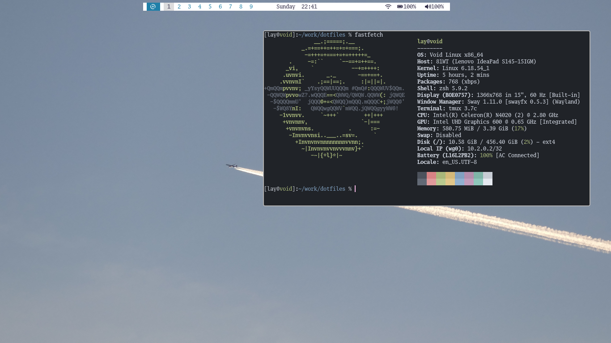

  

---
# Terminal Life - l4y Dotfiles
---

### automakedot.sh

|Item|Details|
|:---|:---|
| Type | Shell script |
| Description | Script that automates the dotfiles setup (links configs to their places) |

### FashionsPhotos

|Item|Details|
|:---|:---|
| Type | Directory |
| Description | Screenshots of the desktop and terminal setup |

### foot

|Item|Details|
|:---|:---|
| Version | foot version: 1.28.0 |
| Minimalist | Yes |
| Description | Config Terminal Emulator (Wayland) |

### htop

|Item|Details|
|:---|:---|
| Version | htop 3.5.3-3.5.3 |
| Minimalist | Yes |
| Description | Config Process Monitor |

### irssi

|Item|Details|
|:---|:---|
| Version | irssi 1.4.5 |
| Minimalist | Yes |
| Description | Config IRC Client |

### lifeinshell

|Item|Details|
|:---|:---|
| Type | Directory |
| Description | Shell life files (scripts and extras for the terminal workflow) |

### links

|Item|Details|
|:---|:---|
| Version | Links 2.30 |
| Minimalist | Yes |
| Description | Config Text-mode Browser |

### localbin

|Item|Details|
|:---|:---|
| Type | Directory |
| Description | Personal scripts and executables for `~/.local/bin` |

### qutebrowser

|Item|Details|
|:---|:---|
| Version | Null |
| Minimalist | Yes |
| Description | Config Browser (keyboard-driven) |

### sway

|Item|Details|
|:---|:---|
| Version | swayfx version 0.5.3 |
| Minimalist | Yes |
| Description | Config Window Manager (Wayland, i3-compatible) |

### tmux

|Item|Details|
|:---|:---|
| Version | Null |
| Minimalist | Yes |
| Description | Config Terminal Multiplexer |

### vim

|Item|Details|
|:---|:---|
| Version | `VIM - Vi IMproved 9.2` |
| Minimalist | Yes |
| Description | Config Text Editor |

### wallpaper

|Item|Details|
|:---|:---|
| Type | Directory |
| Description | Desktop wallpapers |

### zsh

|Item|Details|
|:---|:---|
| Version | `zsh 5.9.2 (x86_64-musl)` |
| Minimalist | Yes |
| Description | Config Shell |
